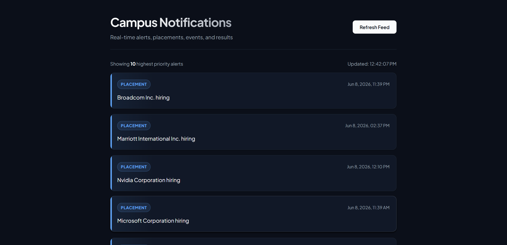
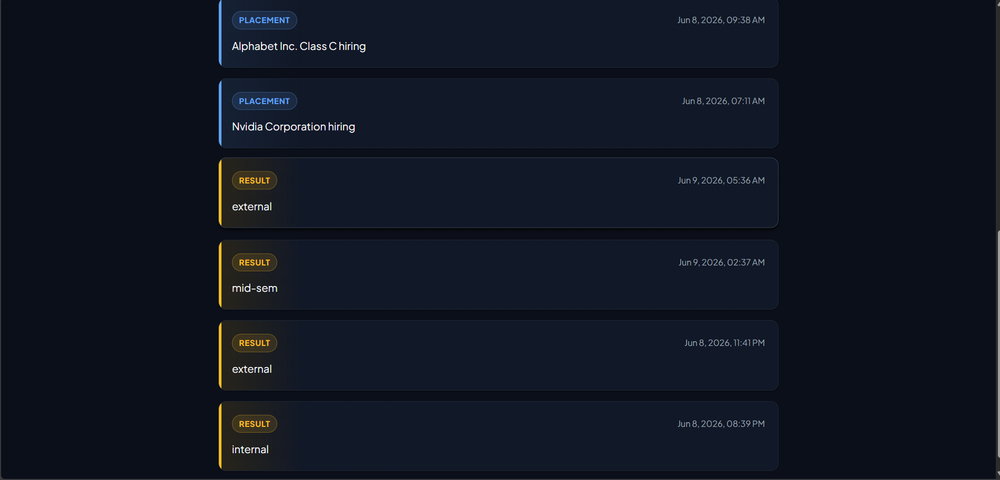
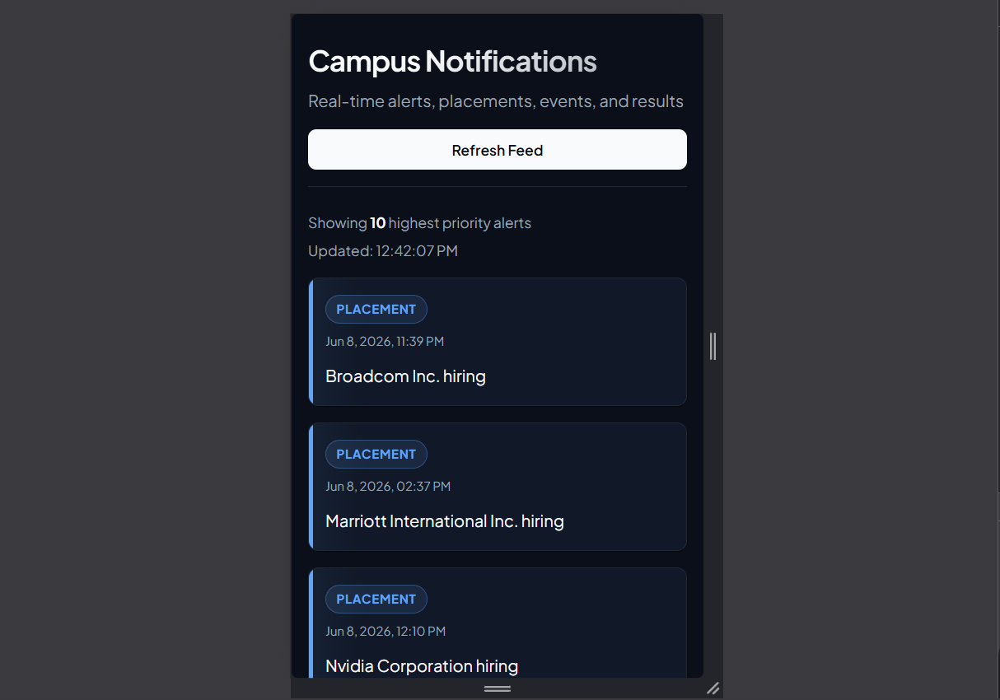
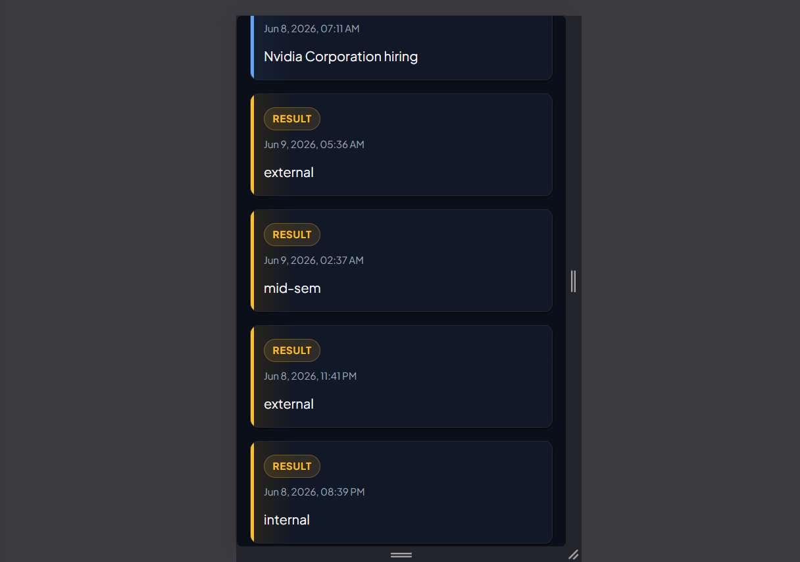

# AffordMed Campus Notifications Hub

A React + TypeScript + Vite web application built for the Campus Notifications Microservice assessment. It fetches, filters, and ranks critical campus updates using a custom client-side Min-Heap data structure to maintain the top 10 highest priority notifications.

## Key Features
- **Min-Heap Prioritizer**: Keeps heap size $\le 10$, optimizing client filtering down to $O(N \log K)$ runtime and $O(K)$ space.
- **Priority Rules**: Placement (highest) > Result (medium) > Event (lowest). Ties resolved by latest timestamp.
- **Logging Middleware**: Reusable REST-based logger transmitting events (App Loaded, API start/success/failure, Sort actions, State mutations) with authorization.
- **Vanilla CSS**: Clean card layout, interactive micro-animations, loading indicators, custom empty states, and fully responsive layouts.

---

## 🛠️ Architecture

The codebase conforms to a clean, modular architecture:

```
src/
├── api/
│     └── notificationApi.ts    # Fetch logic + authorization + logging coverage
│
├── components/
│     └── NotificationCard.tsx   # Premium card visuals + priority-based accents
│
├── pages/
│     └── NotificationsPage.tsx  # State orchestrator + Min-Heap execution
│
├── types/
│     └── Notification.ts        # Typed notification interface
│
├── utils/
│     ├── heap.ts                # Min-Heap sorting utility & comparators
│     └── logger.ts              # POST logger middleware matching evaluation requirements
│
├── App.tsx                      # Bootstrap entry point with mount logging
└── main.tsx                     # DOM hook
```

---

## ⚙️ Environment Configuration

This project relies on a Bearer Token to access both the notifications feed and log transmission endpoints.

1. In the project root, locate `.env.example`.
2. Create a `.env` file in the same directory:
   ```bash
   cp .env.example .env
   ```
3. Set your authorization token:
   ```env
   VITE_AUTH_TOKEN=YOUR_EVALUATION_BEARER_TOKEN
   ```

*Note: The token will be injected dynamically into headers. Never commit your `.env` file with actual secrets.*

---

## 🚀 Setup & Execution

### 1. Prerequisites
Ensure you have [Node.js](https://nodejs.org/) installed (version 18+ recommended).

### 2. Install Dependencies
Install the required React 19 and Vite 8 packages:
```bash
npm install
```

### 3. Run Development Server
Spin up the local developer instance with Hot Module Replacement (HMR):
```bash
npm run dev
```
Open [http://localhost:5173](http://localhost:5173) in your browser.

### 4. Build Production Bundle
To compile and optimize the production bundles:
```bash
npm run build
```
You can preview the built static bundle using:
```bash
npm run preview
```
## Screenshots

### Desktop View 1



### Desktop View 2



### Mobile View 1



### Mobile View 2


